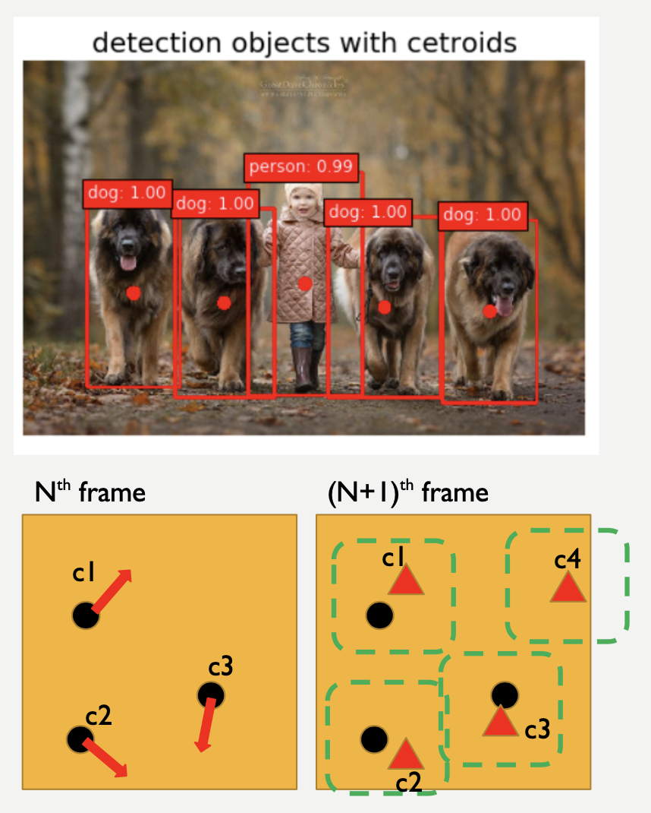
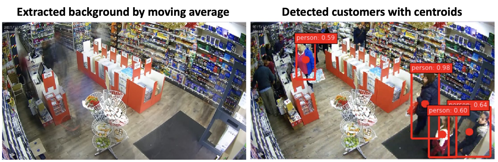

# KNOWYOURMOVE

***KnowYourMove*** is a ComputerVision-based business intelligence tool that tracks the **motion** of individual customers from store surveillance camera systems. It analyzes the video and generates the information maps that can provide business owners with valuable insights to understand their customers better (in terms of their shopping routes and aggregated time spent in different areas). The model has been deployed as a web application [<www.knowyourmove.store>](http://www.knowyourmove.store) where a user can upload a surveillance video to generate the reports. 

The information can be filtered by specific time windows (i.e. morning/afternoon or weekdays/weekends, etc). Such information is expected to provide time-specific customer traffics at a store so as to enable micro-optimization of business operation such as store floor plannings and pricing strategy without breaching customer privacy.

## Packages

Please run `pip install -r requirements.txt` on your virtual environment to install the required python packages to run KnowYourMove yourself.

## Codes

* Full details of the project can be found in the Jupyter notebook, [HERE](https://github.com/sungsujaing/INSIGHT-project/blob/master/Motion_analyzer.ipynb).
* Full details of the Flask web deployment on AWS can be found [HERE](https://github.com/sungsujaing/INSIGHT-project/tree/master/application/KYM_app_v2).
* For testing purposes, if a YouTube video needs to be downloaded, this notebook can be used, [HERE](https://github.com/sungsujaing/INSIGHT-project/blob/master/download_video.ipynb).

## Repository folder description

* ReadMe_Images
* application - KnowYourMove that is currently hosted on AWS
* archive-youtube_scrap - KnowYourMove that takes Youtube video link as an input
* Motion_analyzer.ipynb - main tutorial notebook for KnowYourMove
* download_video.ipynb - supplementary notebook to download Youtube videos
* requirements.txt

## Model structure

The model is based on:

* SSD (Single shot detector) model
* Centroid tracking algorithm

## Results

As part of the process, a background image is first extracted from the entire video. By using the moving average technique, moving objects in a video get removed while the still background is recovered. This image shows an example of the extracted background and the single frame of the processed video. Video source: [YouTube](https://www.youtube.com/watch?v=KMJS66jBtVQ)

The resulting report includes:

* Trajectory map (color: customers, intensity: time spent)
* Contour map: aggregated time spent by the general population

While tested on rather a short video, it was clearly shown that different distribution of customer traffics were extracted from different time window filters. it would be easy to implement KnowYourMove to a longer video (i.e. a day-long video) to understand how the customer traffics may differ at different time of a day.

## Web application DEMO

**NOTE**: The current web application is being hosted on ***AWS t2.micro***, setting limitations on uploadable video size and processing time. 

**NOTE**: This shows how the first 1 second of the video gets processed for demo purposes.

## Acknowledgements

* SSD weights were downloaded from *pierluigiferrari*'s [repo](https://github.com/pierluigiferrari/ssd_keras).
